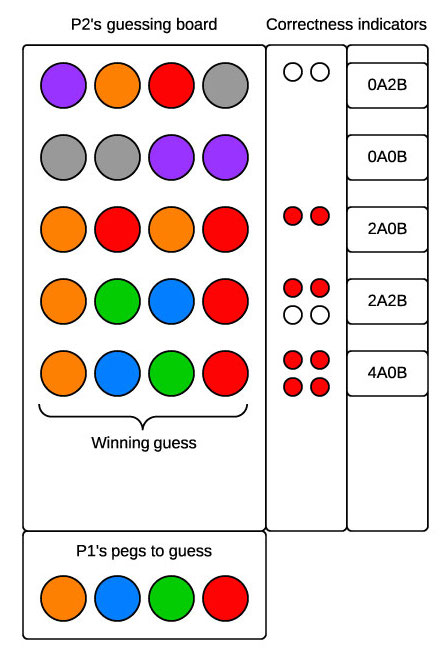

# Mastermind

##Learning Competencies

* Use modeling to translate problems into code
  * Decompose a problem into smaller, easier-to-solve components
  * Diagram the relationship between the 'real world' and 'code'
  * Elucidate the action of a method with a real world example
  * Model a real world system using ruby code
  * Translate between different modes of modeling a problem (user stories, diagrams, pseudocode, etc.)
  * Use Pseudocode effectively to model problem-solving
  * Read Pseudocode and translate to code
  * Identify limitations of model approximation of a problem
  * Identify the possible states of a program and explain under what conditions it will enter each state

* Utilize common data structures
  * Manipulate and access data in any of the common data structures
  * Determine when to use a particular data structure
  * Manipulate and access array data in simple and nested arrays

* Implement Object Oriented programming practices:
  * Create well-defined classes with a single responsibility
  * Identify and implement classes based on real world requirements
  * Implement clean and flexible interfaces between objects
  * Use composition to give structure to more complex objects
  * Use the model-view-controller pattern to organize code and decouple concerns
  * Decompose a problem in various dimensions including (but not limited to): separation of concerns, law of demeter, frequency of use, frequency of change, encapsulation, loose coupling, and the single-responsibility principle

##Summary

Build a command line version of the classic puzzle game [Mastermind](https://en.wikipedia.org/wiki/Mastermind_(board_game)) (otherwise known as [Bulls and Cows](https://en.wikipedia.org/wiki/Bulls_and_cows)).

###Game Components
1. The game board is 4 columns wide and 12 rows high.
2. The pegs that are placed in the slots on the game board can be one of six colors.

###Gameplay
1. Player one chooses four pegs, each of any color, in a specific order. Player two should not be able to see the pegs that player one chooses until the end of the game.
2. Player two has up to 12 turns to guess the exact color and order of the pegs that player one chose. Player two places these pegs in the first row of the board.
3. After each guess, player one informs player two of:
  1. how many pegs of the four were the correct color and in the correct location (these are usually signified by smaller red pegs or a numeral followed by an 'A'); and
  2. how many pegs of the four were the correct color but in the wrong location (these are usually signified by smaller white pegs or the a numeral followed by a 'B').
4. Player two wins the game if she correctly guesses all four colors and locations.
5. Player two loses if she does not guess all four locations after 12 turns.

###Example board

##Releases

###Release 0 : Design the system

- Use a whiteboard or piece of paper to model the various components of the game. Think about how you will represent the board, the rows and the pegs.
- From your whiteboarded design, pseudocode classes (blueprints for objects), data structures (the state of your objects), and methods (the behavior of your objects) you will use.

###Release 1 :  Determine the gameplay

- The user assumes the role of Player Two and the computer, as Player One, chooses four random pegs.
- The user chooses four colored pegs.
- The computer informs the user of how many pegs were correctly positioned and how many were the correct color in the wrong position.
- The history of the user's choices and the correctness of the positions remains on the screen for each turn.
- The game ends after the user correctly guesses the computer's combination or after 12 incorrect guesses.

###Release 2 :  Refactor

Refactor your code. Keep in mind the concepts from POODR chapters 2-4. Ask yourself some of the following questions:

- Is it DRY?
- Are the methods and variables appropriately named?
- Does it utilize appropriate data structures?
- Is it concise and comprehensible?
- Do each of the classes and methods have a single responsibility?
- Whose job is it  to perform which behavior (i.e. which class should contain which methods)?

###Release 3 : Add features (optional)

- Two player functionality
  - Another human player can choose the hidden colors (make sure that you include some mechanism such that Player Two cannot see the colors and positions that Player One chooses).
  - Make it competitive! Allow the two human players to alternate playing and choosing and keep track of how quickly each player wins the game (number of choices, time to win or both).
- Persistence
  - When playing against the computer or another human, ask for each player's username. Use a CSV file to rank players by how quickly they win the game.
- Difficulty levels
  - Allow the user to choose how many columns, rows and peg colors to play with.
  - What makes for an easier or harder game?

##Resources
* Wikipedia entries on [Mastermind](https://en.wikipedia.org/wiki/Mastermind_(board_game)) and [Bulls and Cows](https://en.wikipedia.org/wiki/Bulls_and_cows)
* [The math behind the most efficient solving algorithm](http://mathworld.wolfram.com/Mastermind.html)
