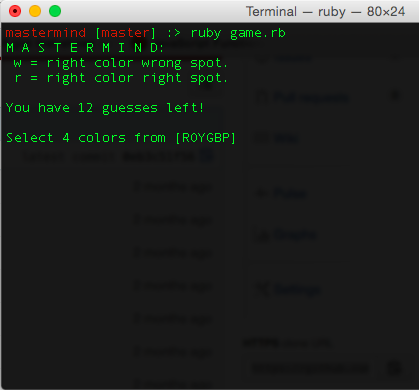

# Mastermind for the Command Line
## [Instructions](https://en.wikipedia.org/wiki/Mastermind_(board_game))
The two players decide in advance how many games they will play, which must be an even number. One player becomes the codemaker, the other the codebreaker. The codemaker chooses a pattern of four code pegs. Duplicates are allowed, so the player could even choose four code pegs of the same color. The chosen pattern is placed in the four holes covered by the shield, visible to the codemaker but not to the codebreaker. The codebreaker may have a very hard time finding out the code.[3]

The codebreaker tries to guess the pattern, in both order and color, within twelve (or ten, or eight) turns. Each guess is made by placing a row of code pegs on the decoding board. Once placed, the codemaker provides feedback by placing from zero to four key pegs in the small holes of the row with the guess. A colored or black key peg is placed for each code peg from the guess which is correct in both color and position. A white key peg indicates the existence of a correct color code peg placed in the wrong position

## Installation

```sh
$ git clone [git-repo-url]
$ cd /mastermind
$ ruby game.rb
```

## Game Play:
#### colors are represented by their first letter

#### make guesses by order peg colors and getting clues (w & r)

#### to exit, press control + c, guess the code, or lose

